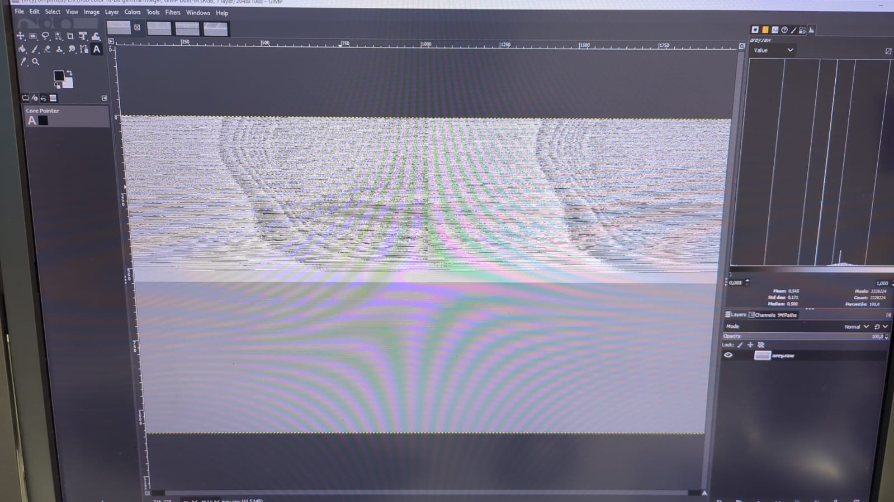
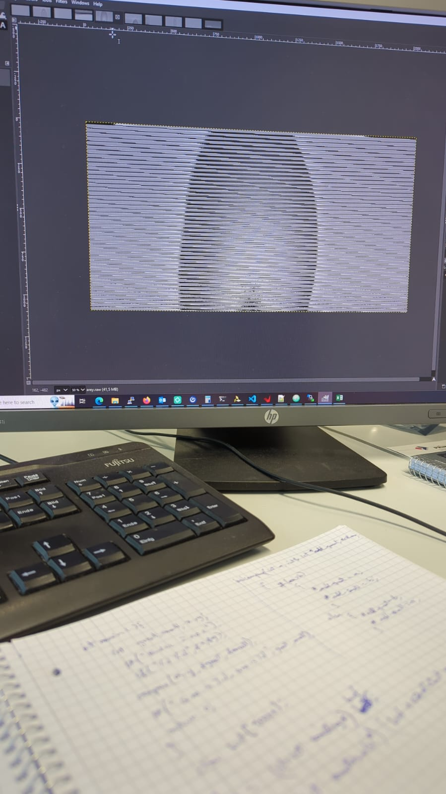
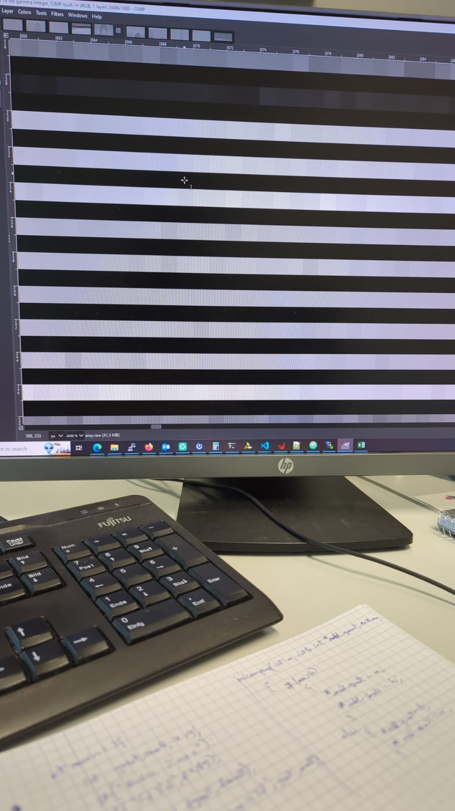

# Unable to get a full resolution image

We have the following media device as video pipeline to capture an image,

* CMV Sensor
* Receive Interface (RXIF)
* Capture device

In the actual hardware, the data is stored into memory using a VDMA.

## CMV Sensor

* The sensor is capable of sending 10/12 bits per pixel (bpp).
* We are using the 12 bpp mode.
* The sensor is a Monochrome one.
* It is defined as a v4l2-subdev as part of the media device
* The MEDIA_BUS_FMT is **Y12_1x12**

## Receive Interface (RXIF)

* It is a custom made IP core that we use to convert the LVDS data to a video data along with the control signals.
* The output is packed to either 8/10/12/16 bpp video signals along with hsync, vsync signals.
* We are currently using 12 bpp.
* This is also defined as another v4l2-subdev.
* The MEDIA_BUS_FMT is also **Y12_1x12**.

## Capture device

* The capture device consists of the VDMA.
* The VDMA is defined with `1` frame buffer.
* The MEDIA_BUS_FMT is also declared as **Y12_1x12**.

## Device tree

* In the device tree all the `xlnx,video-width` are set to `12`.
* The nodes in which `xlnx,video-width` is present are,
  * rxif, sink
  * rxif, source
  * Sensor

Now after setting these things, we are using `yavta` to capture an image. The Video pixel format that we are using to capture is V4L2_PIX_FMT_Y12.

    yavta -s 2048x1088 -n 1 -f Y12 --capture=1 /dev/video0 -Farey.raw

* We are able to capture an image from the sensor but the image is not a full image.
* We are using GIMP to view the raw image using the raw extension provided in GIMP.
* We are getting something which felt like it was redundant in the first two quandrants and the third and fourth are empty, as follows

* Later this redundancy was rectified by changing the VDMA's HSIZE register which requires the value to be set as the SIZE OF BYTES rather than the size of the horizontal pixels.
* The change was made in the drivers/dma/xilinx/xilinx_dma.c:1416 
    
        vdma_desc_write(chan, XILINX_DMA_REG_HSIZE, last->hw.hsize*4);
        
        vdma_desc_write(chan, XILINX_DMA_REG_FRMDLY_STRIDE,
                last->hw.stride*4);

This change resulted in the following capture,

I am currently unsure why in our baremetal program, the HSIZE = hsize*4 and not hsize*2

In this image, we observed that every alternating line is `0x0` as follows

This is where I am currently stuck and I am unsure where to look for the problems. 